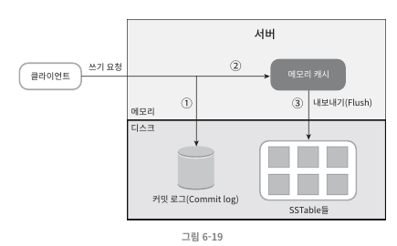
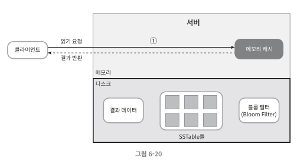
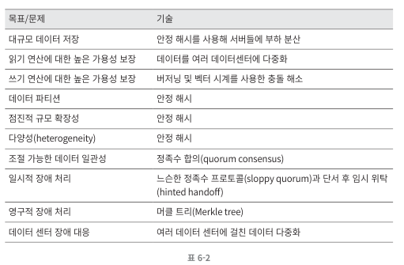

# 2주차 문서

## 목차
1. [처리율 제한 장치의 설계](#1-처리율-제한-장치의-설계)
2. [안정 해시 설계](#2-안정-해시-설계)
3. [키-값 저장소 설계](#3-키-값-저장소-설계)

## 1. 처리율 제한 장치의 설계
클라이언트 또는 서비스가 보내는 트래픽의 처리율을 제어하기 위한 장치이다

### 예시
- 사용자는 초당 2회 이상 새 글을 올릴 수 없다
- 같은 IP 주소로는 하루에 10개 이상의 계정을 생성할 수 없다
- 같은 디바이스로 주당 5회 이상 리워드를 요청할 수 없다

### 요구 사항
- 설정된 처리율을 초과하는 요청은 정확하게 제한한다.
- 낮은 응답 시간: 이 처리율 제한 장치는 HTTP 응답 시간에 나쁜 영향을 주어서는 안 된다.
- 가능한 한 적은 양의 메모리를 사용해야 한다.
- 분산형 처리율 제한: 하나의 처리율 제한 장치를 여러 서버나 프로세스에서 공유할 수 있어야 한다.
- 예외 처리: 요청이 제한되었을 때는 그 사실을 사용자에게 분명하게 보여줘야 한다.
- 높은 결함 감내성: 제한 장치에 장애가 생기더라도 전체 시스템에 영향을 주어서는 안 된다.

### 처리율 제한 알고리즘 종류
- **토큰 버킷**
- **누출 버킷**
- **고정 윈도 카운터**
- **이동 윈도 로그**
- **이동윈도 카운터**

## 2. 안정 해시 설계
해시 키 재배치(rehash) 문제를 해결하기 위한 설계. 서버 추가 또는 삭제가 있을 때, 평균적으로 k/n 개의 키만 재배치되어야 한다.

### 구현 방법
- 해시 키: `serverIndex = hash(key) % N` (N은 서버의 개수)
- SHA-1 해시 함수 사용하여 해시 키 생성
- 해시 공간에 서버를 매핑하여 해시 충돌 최소화

## 3. 키-값 저장소 설계
키-값 데이터베이스, 고유 식별자를 키로 사용하는 비관계형 데이터베이스이다.

### 분산 키-값 저장소
- 분산 해시 테이블 (Distributed Hash Table, DHT) 사용
- CAP 정리에 기반한 설계:
    - 데이터 일관성 (Consistency)
    - 가용성 (Availability)
    - 파티션 감내 (Partition Tolerance)

### 일관성 모델
- 강한 일관성: 모든 사본에 데이터가 쓰기가 될 때까지 해당 데이터 lock
- 약한 일관성: 가장 최근에 갱신된 결과를 반환받지 못할 수 있음
- 최종 일관성: 갱신 결과가 결국에는 모든 사본에 반영되는 모델 (동기화)

### 데이터 파티션
- 데이터를 여러 노드에 분산하여 저장
- 데이터 다중화를 통해 장애 감내성 향상

### 장애 처리
- **장애 감지**: 장애가 발생했을 때 신속하게 감지하는 메커니즘
- **장애 해소**: 장애 발생 시 데이터의 일관성과 가용성을 유지하기 위한 전략
- **가십 프로토콜 (Gossip Protocol)**: 분산 시스템에서 노드 간의 정보를 효율적으로 교환하기 위해 사용하는 프로토콜

### 시스템 아키텍처 다이어그램
- **쓰기 경로**: 새로운 데이터 또는 업데이트된 데이터가 시스템에 쓰여지는 방식을 설명하는 다이어그램
    - 
- **읽기 경로**: 데이터를 조회할 때의 데이터 흐름을 설명하는 다이어그램
    - 

### 요약
- 이번 장에서는 처리율 제한 장치, 안정 해시, 그리고 키-값 저장소 설계에 대해 다루었다. 각 설계는 분산 시스템에서의 효율성, 확장성, 그리고 장애 감내 능력을 개선하기 위해 중요한 역할을 한다.
  